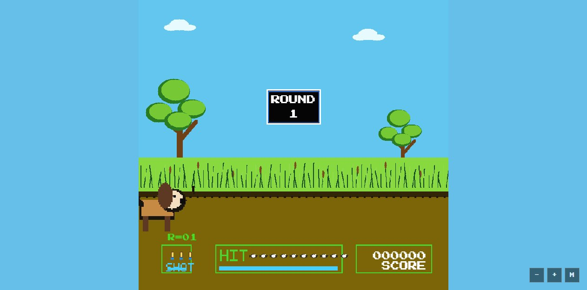

# Pond Patrol Wallpaper

An original retro pond target-shooter web wallpaper for Wallpaper Engine.



## Wallpaper Engine Import

The ready-to-import wallpaper bundle is in `build/`.

In Wallpaper Engine:

1. Open the editor.
2. Create or import a web wallpaper.
3. Select `build/index.html`.
4. Wallpaper Engine will read `build/project.json` for metadata and customization properties.

## Features

- Mouse-playable HTML5 Canvas game.
- Original generated pixel-art sprites, background, UI assets, and synthesized sound effects.
- Responsive desktop scaling with `contain`, `cover`, and `stretch` fit modes.
- Correct click targeting after canvas scaling.
- Local fonts and local assets, with no runtime web dependencies.
- Wallpaper Engine user properties:
  - Volume
  - Mute
  - Fit mode
  - Show or hide HUD
  - Show or hide volume controls
  - Show or hide cursor
  - Enable or disable mouse interaction
  - Autostart game
  - Bird speed
- Wallpaper Engine pause/resume and FPS property hooks.
- Local preview and automated QA scripts.

## Development

Install dependencies:

```powershell
npm.cmd install --legacy-peer-deps
```

Build the Wallpaper Engine bundle:

```powershell
npm.cmd run build
```

Prepare a Steam Workshop upload package:

```powershell
npm.cmd run verify:release
```

The packaged ZIP is written to `dist/pond-patrol-wallpaper.zip`. See
`docs/STEAM_WORKSHOP.md` for listing copy and the manual upload checklist.

Regenerate the original project assets:

```powershell
npm.cmd run assets:original
```

Serve the built wallpaper locally:

```powershell
npm.cmd run serve:wallpaper
```

Run automated verification:

```powershell
npm.cmd run verify:all
```

Or run the checks individually:

```powershell
npm.cmd run verify:bundle
npm.cmd run verify:package
npm.cmd run verify:wallpaper
```

Run the viewport QA matrix:

```powershell
npm.cmd run verify:wallpaper:matrix
```

The verifier saves screenshots to `artifacts/` and checks:

- build bundle metadata, required files, copied assets, local references, and publishing-risk strings
- packaged ZIP root layout, expected files, and file sizes
- menu loads
- canvas scales correctly
- START click enters the running game state
- Wallpaper Engine-style user properties apply correctly

GitHub Actions also runs install, build, and bundle verification on pushes and pull requests.

## Asset Provenance

See `ASSET_MANIFEST.md` for the full asset provenance. In short, the project art,
preview, sprites, UI images, favicon, and sound effects are original/generated
assets for Pond Patrol. Font packages are bundled locally through npm and retain
their upstream licenses.

## Publishing Note

The current bundled art and sound effects are procedurally generated for this project. The gameplay is a retro target-shooter homage and is not affiliated with any classic console publisher.

Do not use third-party names, logos, characters, or audio when publishing to Steam Workshop or another public marketplace.
